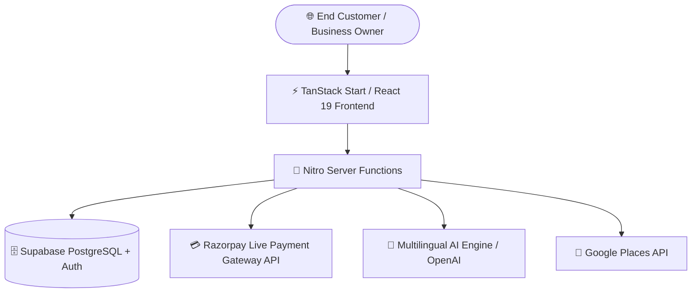

<div align="center">

  

  <p align="center">
    <strong>Self-hosted, Production-grade Google Review & Reputation Automation Suite for Indian Businesses</strong>
  </p>

  <p align="center">
    <a href="https://www.intellectflows.in">
      
    </a>
    <a href="https://github.com/intellectflowteam/intellectflow">
      
    </a>
    <a href="https://tanstack.com/start/latest">
      
    </a>
    <a href="https://supabase.com">
      
    </a>
    <a href="https://razorpay.com">
      
    </a>
  </p>

  ---
</div>

## 🌟 Key Features

<table width="100%">
  <tr>
    <td width="50%">
      <h3>⭐ Smart 5★ Google Review Filter</h3>
      <p>Routes 5-star happy customers directly to Google Maps, while capturing 1–3 star private feedback internally to protect business ratings.</p>
    </td>
    <td width="50%">
      <h3>🤖 Multilingual AI Review Writer</h3>
      <p>Automatically weaves target SEO keywords into customer reviews across 4 languages: <b>English, Hindi (हिंदी), Gujarati (ગુજરાતી), Marathi (मराठी)</b>.</p>
    </td>
  </tr>
  <tr>
    <td width="50%">
      <h3>🎨 AI Social Promo Poster Generator</h3>
      <p>Generates 1200×630 pixel-perfect branded social banners for GMB posts & social media automatically with 1-click publishing.</p>
    </td>
    <td width="50%">
      <h3>📅 Direct Publishing & Date Scheduler</h3>
      <p>Schedule GMB updates with custom date & time pickers, or publish immediately with status queue tracking (Scheduled, Published, Drafts).</p>
    </td>
  </tr>
  <tr>
    <td width="50%">
      <h3>📍 2km Hyperlocal Competitor Tracker</h3>
      <p>Auto-fetches nearby competitors within 2km radius using Google Places API, with location resolution & automated SWOT Analysis.</p>
    </td>
    <td width="50%">
      <h3>💳 Razorpay Live Dual Checkout</h3>
      <p>Zero-glitch direct hosted checkout & embedded modal supporting UPI (GPay, PhonePe, Paytm), Cards & NetBanking with server-side price validation.</p>
    </td>
  </tr>
</table>

---

## 🛠️ Technology Stack



- **Frontend**: React 19, TanStack Start, TanStack Router, TailwindCSS, Lucide Icons, Canvas Confetti
- **Backend / SSR**: Nitro Server Engine, TanStack Server Functions, TypeScript
- **Database & Auth**: Supabase PostgreSQL with RLS policies & Row-level Row Security
- **Payments**: Razorpay Live API (Payment Links & Orders with SHA-256 HMAC verification)
- **Deployment**: Vercel / Docker / Node.js self-hosted VPS (0 platform locking)

---

## ⚡ Interactive Quick Start

<details>
<summary><b>1. Clone & Install Dependencies</b> (Click to Expand)</summary>

```bash
# Clone the repository
git clone https://github.com/intellectflowteam/intellectflow.git
cd intellectflow

# Install project dependencies
npm install
```
</details>

<details>
<summary><b>2. Set Up Environment Variables</b> (Click to Expand)</summary>

Create a `.env` file in the root folder:

```env
# Supabase Configuration
VITE_SUPABASE_URL="https://YOUR_PROJECT_REF.supabase.co"
SUPABASE_URL="https://YOUR_PROJECT_REF.supabase.co"
VITE_SUPABASE_PUBLISHABLE_KEY="YOUR_ANON_KEY"
SUPABASE_PUBLISHABLE_KEY="YOUR_ANON_KEY"
SUPABASE_SERVICE_ROLE_KEY="YOUR_SERVICE_ROLE_KEY"

# Razorpay Payments API Keys
RAZORPAY_KEY_ID="rzp_live_..."
VITE_RAZORPAY_KEY_ID="rzp_live_..."
RAZORPAY_KEY_SECRET="..."

# AI & OpenAI API Keys
AI_API_KEY="sk-..."
```
</details>

<details>
<summary><b>3. Run Locally</b> (Click to Expand)</summary>

```bash
# Start local development server
npm run dev
```
Open `http://localhost:8080` in your browser.
</details>

---

## 🚢 Self-Hosted Production Deployment

Because **IntellectFlow** is built with **TanStack Start** and **Nitro Engine**, it compiles to a standalone Node.js server. Deploy anywhere:

```bash
# Build production bundle
npm run build

# Start production Node server (Port 3000)
npm start
```

| Deployment Environment | Command |
| :--- | :--- |
| **Vercel** | `npx vercel --prod` |
| **Docker** | `docker build -t intellectflow . && docker run -p 3000:3000 intellectflow` |
| **Linux VPS (PM2)** | `pm2 start .output/server/index.mjs --name intellectflow` |

---

## 🔒 Security & Privacy

- **Protected Secrets**: `.env` and sensitive API keys are strictly excluded via `.gitignore` and never committed to version control.
- **HMAC Signature Verification**: All Razorpay webhooks and payment callbacks verify SHA-256 signatures server-side.
- **Row Level Security (RLS)**: Database tables are secured via Supabase RLS policies ensuring multi-tenant data isolation.

---

<div align="center">
  <sub>Built with ❤️ for Indian Businesses & Entrepreneurs | Self-hosted & Autonomous</sub>
</div>
